<div align="center">



# ✦ Nova

**Une assistante vocale française qui vit sur ton Mac.**
Elle t'écoute, réfléchit avec Groq, et te répond **à voix haute** — le tout en local.

[](https://github.com/DmzGamingYT/nova/actions/workflows/ci.yml)


[🚀 Démarrage rapide](#-démarrage-rapide) · [📱 App macOS](#-application-macos-native) · [🎙️ Ce qu'elle sait faire](#-ce-quelle-sait-faire) · [🗣️ Commandes vocales](https://dmzgamingyt.github.io/nova/commandes.html) · [🌐 Site web](https://dmzgamingyt.github.io/nova/) · [🏗️ Architecture](#-architecture)

</div>

---

## ✨ Pourquoi Nova

| | |
|---|---|
| 🗣️ **Voix naturelle** | Parle, elle répond — voix françaises de macOS, lecture phrase par phrase pendant que le modèle écrit |
| 🧠 **Mémoire réelle** | Elle se souvient de tes conversations, de ton profil, de ton programme de sport — même après redémarrage |
| 🛡️ **Sandbox sécurisée** | Liste blanche d'actions, exécution sans shell, **carte de confirmation** avant toute action sur le Mac |
| ⚡ **Zéro dépendance** | Le serveur est du Node.js pur : aucun `npm install`, aucun framework, 68 tests |
| 🌙 **Mot d'activation** | Dis « Nova » comme tu dirais « Siri » — elle s'éveille, écoute, répond, se rendort |
| 🏋️ **Coach sportif** | Elle lit ton programme Pulse : séance du jour, technique, progression, validation vocale |

<br/>

## 🚀 Démarrage rapide

```bash
# 1. Récupère le projet
git clone https://github.com/DmzGamingYT/nova.git && cd nova

# 2. Ta clé Groq (gratuite — console.groq.com/keys)
cp .env.example .env      # puis GROQ_API_KEY=gsk_…

# 3. Lance
./start.command           # → http://localhost:8787
```

> 💡 **Sans clé API**, Nova tourne en *mode démo* : interface, voix et streaming fonctionnent,
> mais les réponses sont pré-écrites. Avec une clé, elle devient pleinement intelligente —
> tu peux aussi la coller dans les **Réglages** (⚙️ ou `⌘,`), elle reste sur ta machine.

<div align="center">

```text
        ╭──────────────────────────────────────────╮
        │  ✦  Nova — Assistant IA vocal            │
        │  Adresse locale : http://localhost:8787  │
        │  Clé Groq       : ✓ trouvée (gsk_KB…)    │
        │  Modèle         : openai/gpt-oss-120b    │
        ╰──────────────────────────────────────────╯
```

</div>

<br/>

## 📱 Application macOS native

Nova se compile en **vraie application de barre de menus** : son icône vit dans la barre
macOS, un clic (ou **⌘⇧Espace** où que tu sois) ouvre un **panneau flottant** façon
Spotlight — au-dessus de tout, replié dès que tu cliques ailleurs ou tapes `Échap`.
Permissions micro intégrées, pensée pour **Apple Silicon** (M1 → M4).

```bash
cd desktop
npm install        # ~11 s
npm run dist       # → release/Nova-<version>-arm64.dmg (build universel : npm run dist:universal)
```

- `Nova.app` : glisse-la dans **Applications**, ouvre-la — l'icône apparaît dans la barre
  de menus ; `⌘⇧Espace` ouvre/ferme le panneau, le menu offre aussi une fenêtre complète
- Ou `npm start` pour lancer l'app en mode dev
- L'app ne remplace pas le serveur : elle **l'affiche** dans sa propre fenêtre sans barre de navigateur

> 🔓 Le DMG n'est pas signé (build personnel) : au premier lancement, clic droit → **Ouvrir**.

**Téléchargement direct** : chaque tag `v*` produit un DMG en [release GitHub](https://github.com/DmzGamingYT/nova/releases/latest) — avec `SHA256SUMS.txt` et le changelog automatiques.

### 🔒 Vérifier ton DMG (SHA-256)

Chaque release publie un fichier **`SHA256SUMS.txt`** généré par la CI. Place-le dans le
même dossier que le DMG téléchargé, puis :

```bash
# macOS
shasum -a 256 -c SHA256SUMS.txt
# → Nova-1.2.1-arm64.dmg: OK
```

```bash
# Linux
sha256sum -c SHA256SUMS.txt
```

```powershell
# Windows (PowerShell) — comparer à la ligne du SHA256SUMS.txt
Get-FileHash Nova-1.2.1-arm64.dmg -Algorithm SHA256
```

<details>
<summary><b>❌ Le hash ne correspond pas ?</b></summary>

Ne lance pas le DMG. Deux causes possibles :

- **Téléchargement incomplet** — retélécharge (un proxy ou un réseau captif peut tronquer
  les gros fichiers) et revérifie ;
- si ça diffère encore, compare le hash affiché avec celui de la **page de la release**
  (le bloc « Checksums SHA-256 » des notes) et [signale-le dans les Issues](https://github.com/DmzGamingYT/nova/issues)
  en précisant la version, ton OS et le hash obtenu.

</details>

<br/>

## 🎙️ Ce qu'elle sait faire

<details open>
<summary><b>conversation & voix</b> — cliquer pour replier</summary>

| Action | Comment |
|---|---|
| Parler | **Maintiens la barre espace** ou le bouton micro, parle, relâche |
| Conversation naturelle | Bouton ⚡ (ou `⌘C`) : parle sans rien toucher, elle enchaîne toute seule |
| Réveil vocal « Nova » | Bouton lune : en veille, elle n'écoute qu'en entendant son nom |
| La couper | Parle par-dessus (barge-in) ou `échap` |
| Écrire | Champ de saisie, `Entrée` pour envoyer |
| Ré-écouter | Survol une réponse → « ↺ écouter », ou « Nova, répète » |

</details>

<details>
<summary><b>💬 commandes vocales</b></summary>

| Commande | Effet |
|---|---|
| « Nova, coupe-toi » | Coupe sa voix |
| « Nova, efface » / « annule » | Vide (ou rétablit) la conversation affichée |
| « Nova, plus vite » / « moins vite » | Ajuste sa vitesse de lecture |
| « Nova, change de voix » | Voix française suivante de macOS |
| « Nova, minuteur de 10 minutes » | Minuteur avec carillon + annonce vocale |
| « Nova, va en veille » | Se rendort tout de suite |
| « Nova, oublie tout » | Efface sa mémoire persistante |
| « Nova, qu'as-tu retenu ? » | Récapitule à voix haute ce qu'elle sait de toi |
| « Nova, séance terminée » | Valide la séance de sport du jour |

*Les formulations voisines sont reconnues (« tais-toi », « chut », « accélère », « redis-moi ça »…).
→ Référence complète et cherchable : **[dmzgamingyt.github.io/nova/commandes.html](https://dmzgamingyt.github.io/nova/commandes.html)***

</details>

<details>
<summary><b>🖥️ contrôle du Mac (sandbox, après confirmation)</b></summary>

| Action | Effet | | Lecture seule (instantané) | |
|---|---|---|---|---|
| `open` | Ouvre un site ou une app | | `now` · `date` | Heure et date exactes |
| `say` | Fait parler le Mac | | `weather` | Météo réelle, sans clé API |
| `notification` | Notification macOS | | `battery` · `disk` · `ip` · `uptime` | État du Mac |
| `volume` | Absolu (`40`) ou relatif (`+10`) | | `clipboard` | Contenu du presse-papiers |
| `brightness` | Luminosité 0–100 | | `workout` · `workout_week` | Programme sport |
| `screenshot` | Capture → `data/screenshots/` | | `training_stats` | Bilan de progression |
| `clipboard_set` | Copie un texte | | | |

**Rien ne s'exécute tout seul** : chaque action affiche une carte *Autoriser / Ignorer*.
Validation stricte des arguments, exécution via `execFile` sans shell — pas d'injection possible.
Interrupteur général dans les réglages (`MAC_CONTROL=off` coupe aussi les routes côté serveur).

</details>

<details>
<summary><b>🏋️ programme de sport (Pulse)</b></summary>

Le programme n'est **jamais recopié : il est lu** dans ton fichier Pulse, et relu dès qu'il change.
La progression, elle, appartient à Nova (`data/training.json`).

| Ce que tu peux dire | Ce qui se passe |
|---|---|
| « Quelle séance j'ai aujourd'hui ? » | Exercices, séries, repos et durée estimée |
| « C'est quoi mon programme cette semaine ? » | Les 7 jours, fait / restant |
| « Comment on fait les pompes ? » | La consigne exacte de ton programme |
| « Où j'en suis ? » | Séances, série en cours, niveau, phase |
| « Nova, séance terminée » | Valide la séance (commande instantanée) |

*Phases : Fondation → Développement → Intensité → Allègement. L'onglet **Sport** des réglages
affiche la séance cochable, la semaine navigable et toute la progression.*

</details>

<details>
<summary><b>⚙️ réglages (six onglets) & mémoire</b></summary>

| Onglet | Contenu |
|---|---|
| **Général** | Clé API Groq, modèle, apparence (auto / clair / sombre) |
| **Voix & veille** | Voix française, vitesse, hauteur, mot d'activation, commandes vocales |
| **Sport** | Séance du jour cochable, semaine, progression, import Pulse |
| **Compétences** | Interrupteur sandbox + catalogue cliquable de tout ce qu'elle sait faire |
| **Profil** | Tes informations — elle personnalise ses réponses sans que tu te répètes |
| **Mémoire** | Conversations archivées, suppression unitaire, tout oublier |
| **Diagnostic** | État réel du système, bouton de copie |

**Mémoire persistante** : les échanges vivent dans `data/memory.json` (gitignored). Les souvenirs
des 6 dernières conversations sont injectés dans son contexte à chaque discussion. Au lancement,
ta dernière conversation se restaure automatiquement.

</details>

<br/>

## ✨ Rendu visuel

<div align="center">

</div>

- Orbe vivante : **pulse avec ta voix** (analyse temps réel), verte quand tu parles,
  violette quand elle réfléchit, ambre quand elle parle
- Verre dépoli, blobs d'arrière-plan, grain de film, halo d'état, orbites
- Thèmes **sombre et clair** (auto → suit macOS)
- Markdown rendu en direct + nettoyage automatique pour la lecture vocale

<br/>

## ⚙️ Personnalisation

```bash
GROQ_API_KEY=gsk_…          # ta clé
PORT=8787                   # port du serveur
GROQ_MODEL=qwen/qwen3.6-27b # modèle par défaut (optionnel)
GROQ_STT_MODEL=whisper-large-v3-turbo
GROQ_MAX_TOKENS=900         # sort du plafond OTPM des comptes gratuits
MAC_CONTROL=on              # "off" coupe toute exécution d'actions
```

**Résilience intégrée** : modèle retiré du compte → bascule automatique vers le meilleur
disponible (et prévenue) · plafond OTPM → retry avec moins de tokens · modèle raisonneur
(`<think>`) → raisonnement filtré en streaming, tu n'entends que la réponse.

<br/>

## 🧪 Tests

```bash
npm test              # 68 tests — vrai serveur, dossier temporaire, zéro appel réseau
npm run check:sport   # vérification manuelle du sport (vraie clé, vraie donnée)
```

Couverture : détection d'intention des compétences, routes HTTP, **traversée de répertoire**
refusée, **sandbox** (toute action hors liste blanche est rejetée), mémoire corrompue,
moteur sport (70 jours comparés aux formules exactes du programme Pulse), import de sauvegarde.

<br/>

## 🏗️ Architecture

```text
server.js            Serveur Node sans dépendance : statiques, proxy SSE Groq
                     (filtre <think> + ACTION, bascule de modèle, retry OTPM),
                     Whisper STT, mémoire + profil, sandbox macOS, diagnostic
lib/
  skills.js          Compétences de lecture (heure, météo, batterie, disque, IP…)
  training.js        Moteur sport : plan Pulse, phases, progression
public/
  index.html         Interface (français)
  style.css          Thèmes sombre + clair (verre & lumière)
  app.js             Conversation, micro, voix, réglages, VAD, barge-in, minuteurs
  wake.js            Mot d'activation « Nova » (Web Speech, repli Whisper)
  orb.js             Orbe réactive + décor canvas
  markdown.js        Mini-markdown résistant au streaming
desktop/             📱 Application macOS (Electron)
  main.js            Barre de menus : Tray, panneau flottant, raccourci global ⌘⇧Espace
  electron-builder.yml   Build DMG arm64 (M1→M4) et universel
  tools/make-icon.py Génération de l'icône (orbe violette)
test/                68 tests + suite sport (fixtures, vrai serveur isolé)
tools/               build-preview.js (UI seule + mock API), check-sport.js
start.command        Double-clic pour tout lancer
data/                memory.json, profile.json, training.json (gitignored)
```

**Sécurité** : la clé passe uniquement entre ton navigateur → serveur local → `api.groq.com`.
Rien d'autre, aucun stockage distant. Les actions Mac exigent ta confirmation, une par une.

<br/>

<div align="center">

**Nova** — fait avec ✦ sur un MacBook Air M4

*[MIT](LICENSE) · propulsé par [Groq](https://groq.com) · les voix appartiennent à macOS*

</div>
